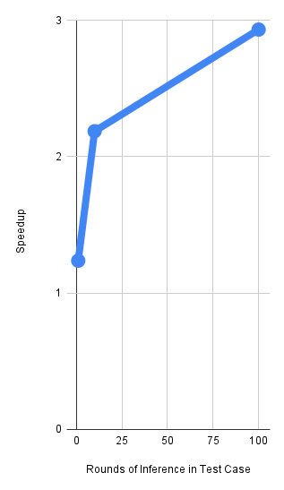
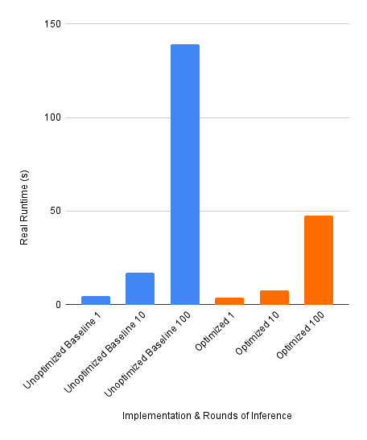

# GPT-2 Inference in C — SIMD Optimization

A from-scratch implementation of GPT-2 base model inference in C, iteratively optimized using hardware profiling and x86 SIMD intrinsics. Achieved a **~44× speedup** over the baseline through AVX2/FMA vectorization and instruction-level parallelism.

## Files

| File | Description |
|------|-------------|
| `gpt2.c` | Baseline implementation — scalar C |
| `gpt2_opt.c` | AVX2/FMA vectorized linear layer (single accumulator) |
| `gpt2_extra.c` | Dual-accumulator AVX2 + improved horizontal reduction (extra credit) |

## What's Implemented

A complete GPT-2 transformer inference pipeline:
- Token and positional embeddings
- 12 transformer blocks, each with:
  - Layer normalization
  - Multi-head self-attention (12 heads, `Q·Kᵀ / √dₖ → softmax → ×V`)
  - 2-layer MLP with GELU activation
  - Residual connections
- Final logit projection → next-token prediction

Model parameters match GPT-2 base: vocab size 50,257 · embedding size 768 · 12 layers.

## Optimization Process

### Step 1 — Profile the baseline

Used `gprof` to identify that `linear()` (matrix-vector multiply) consumed **97.2% of total runtime**.

### Step 2 — AVX2/FMA vectorization (`gpt2_opt.c`)

Replaced scalar `linear()` with `linear_AVX()`:
- Processes **8 floats per iteration** using `_mm256_fmadd_ps` (fused multiply-add)
- Handles tail elements with a scalar fallback

Result: **~3.9× speedup** (20.1s → 5.1s, 10 model runs)

```bash
gcc gpt2_opt.c -o gpt2_opt -lm -mavx2 -mfma
```

### Step 3 — Dual accumulators + efficient horizontal sum (`gpt2_extra.c`)

- Processes **16 floats per iteration** using two independent AVX2 accumulators to exploit instruction-level parallelism and hide FMA latency
- Replaces memory-store horizontal sum with `_mm_hadd_ps` register reduction

With `-O3`: **~44× speedup** (20.1s → ~0.45s per run)

```bash
gcc gpt2_extra.c -o gpt2_extra -lm -mavx2 -mfma -O3
```

## Profiling Results

Intel Top-Down Microarchitecture Analysis (via `toplev`) run on an Intel Sapphire Rapids CPU on Cornell's HPC cluster.




| Version | Runtime (10 runs) | Speedup |
|---------|-------------------|---------|
| Baseline | 20.10s | 1× |
| AVX2/FMA | 5.12s | 3.9× |
| Dual-acc + O3 | ~0.45s/run | ~44× |

Top-Down analysis confirmed the baseline is `Backend_Bound` (memory/compute bottleneck in the linear layer). After optimization, the dominant bottleneck shifted to `gelu()`, confirming the linear layer was fully addressed.

## Tech

C · Intel AVX2/FMA (`<immintrin.h>`) · gprof · Intel toplev (PMU Top-Down Analysis) · GCC
